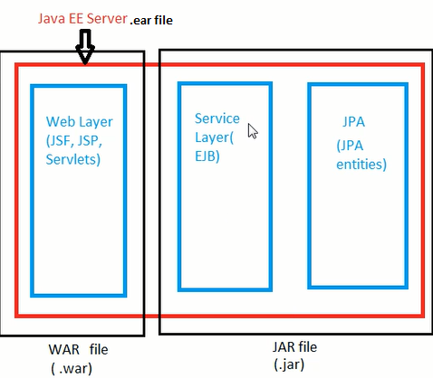

 

EJB(Enterprise java bean) is a specification provided by Sun Microsystems to develop secured, robust, scalable, distributed applications.Vendors uses this specification to implement an infrastructure(EJB Container) in which components(enterprise bean is a server-side component that encapsulates the business logic of an application) can be deployed and provides set of services on that components.
1. Transaction management 
2. Security authorization
3. Manages life cycle of Resource object e.g EntityManager,ejb instances thus developer needs not to worry about when to create/delete ejb objects
4. logging, load balancing, persistence mechanism, exception handling
5. Interceptor
6. Timers
7. Messaging
8. web services support.

Some vendors are glashfish,Jboss,Weblogic,TomEE,WebSphere (IBM),WebLogic (BEA) etc

### Benefits of Enterprise Beans ###
1. Since it is deployed on EJB container.EJB container provides above system-level services.developer can concentrate only develop business logic code
2. Since client developer does not have to code the routines that implement business rules or access databases. As a result, the clients are thinner, a benefit that is particularly important for clients that run on small devices.
3. because enterprise beans are portable components, the application assembler can build new applications from existing beans

### When to Use Enterprise Beans ### 
You should consider using enterprise beans if your application has any of the following requirements.

1. The application must be scalable. To accommodate a growing number of users, you may need to distribute an application’s components across multiple machines. Not only can the enterprise beans of an application run on different machines, but also their location will remain transparent to the clients.

2. Transactions must ensure data integrity. Enterprise beans support transactions, the mechanisms that manage the concurrent access of shared objects.

3. The application will have a variety of clients. With only a few lines of code, remote clients can easily locate enterprise beans. These clients can be thin, various, and numerous.


### EJB >3.0 vs EJB < 3.0  Version ###
The development process of creating EJB between before 3.0 and after 3.0 are different.We need to understand difference between >3.0 and <3.0


EJB < 3.0 | EJB >=3.0 
------------ | -------------
Configuration using programmatic and declarative(using confiquration file) |  Configruation using Annotaton ,and option delcarative way that that facilate quick development
To create enterprise bean need to implement REMOTE,HOME,Local interface | Simple POJO based Bean
Entity bean is used for persistence.it could be either CMP(COntainer managed persistence) or BMP(Bean managed persistence).BMP is programmatic | JPA-java persistence api(replace on entity bean) is for persistence
Access beans through Only JNDI lookup  | Access beans either dependency injection using @EJB annotation or JNDI lookup. 


### Types of Enterprise Beans ###

EJB 3.0 defines two types of enterprise beans.

1. Session Bean
2. Message driven bean

There was another bean before 3.0 called Entity Bean

### Session Bean ###
Session means short duration of time execute something.On otherhand it is not used for persistence.It encapsulates actual business logic like user authentication,credit card validation,shopping card etc

### Client of Session Bean###

### Steps to create a bean of before 2.0 style ###
1. Create bean class with all of the business method
2. Create two interface for the bean
	1. Component Interface either local or remote
	2. Home Interface


3. Create an XML deployment descriptor that tells the server what your bean is and how it should be managed.File name must be ejb-jar.xml under META-INF
4. Register the bean into JNDI . file name may be sun-ejb-jar.xml or EJB container specific file glassfish-ejb-jar.xml(glassfish),weblogic-ejb-jar.xml(Weblogic server) under META-INF
5. Deploy the bean into server using tool provided by vendor

### Example of Hello World EJB ###

1. create maven java project by following command

	`mvn archetype:generate -DgroupId=com.javaaround -DartifactId=EJB -DarchetypeArtifactId=maven-archetype-quickstart -DinteractiveMode=false` 

	Add javaee (include ejb jar) dependency at pom.xml

	```xml
	<dependency>
	    <groupId>javax</groupId>
	    <artifactId>javaee-api</artifactId>
	    <version>7.0</version>
	</dependency>
	```

2. Create HelloWorldBean.java at com/javaaround/ejb

	```java
	package com.javaaround.ejb;
	import javax.ejb.*;
	import java.util.*;

	public class HelloWorldBean implements SessionBean{
		public String hello(){
		     return "Hello World EJB";
		}
		public void ejbCreate() {
			System.out.println( "Ejb create" );
		} 
		public void ejbRemove() {
			System.out.println( "Ejb remove" );
		}
		public void ejbActivate() {
			System.out.println( "Ejb Activate" );
		}
		public void ejbPassivate() {
			System.out.println( "Ejb Passivate" );
		}
		public void setSessionContext(SessionContext sc){
			System.out.println( "SessionContext" );
		}
	}
	```

	Explanation :

	1. Bean must be extends SessionBean. it have four methods(ejbRemove(),ejbActivate(),ejbPassivate(),setSessionContext()) that must be implement
	2. Must have ejbCreate() method . It is EJB rule but not extends from SessionBean
	3. hello() method actual business logic

3. Create HelloWorldRemote.java at com/javaaround/ejb

	```java
	package com.javaaround.ejb;
	import javax.ejb.*;
	import java.rmi.*;
	import java.util.*;
	public interface HelloWorldRemote extends EJBObject{
	   public String hello() throws RemoteException;
	}
	```

	Create HelloWorldHome.java at com/javaaround/ejb

	```java
	package com.javaaround.ejb;

	import javax.ejb.*;
	import java.rmi.*;
	public interface HelloWorldHome extends EJBHome{
	   public HelloWorldRemote create() throws RemoteException,CreateException;
	}
	```
4. Create ejb-jar.xml at com/javaaround/ejb/META-INF

	```xml
	<?xml version="1.0"?>
	<!DOCTYPE ejb-jar PUBLIC
	"-//Sun Microsystems, Inc.//DTD Enterprise JavaBeans 2.0//EN"
	"http://java.sun.com/dtd/ejb-jar_2_0.dtd">

	<ejb-jar>
		<enterprise-beans>
			<session>
				<ejb-name>helloWorldBean</ejb-name>
				<home>com.javaaround.ejb.HelloWorldHome</home> 
				<remote>com.javaaround.ejb.HelloWorldRemote</remote>
				<ejb-class>com.javaaround.ejb.HelloWorldBean</ejb-class>
				<session-type>Stateless</session-type>
				<transaction-type>Container</transaction-type>
			</session>
		</enterprise-beans>
	</ejb-jar>
	```
5. Create sun-ejb-jar.xml at com/javaaround/ejb/META-INF

	```xml
	<!DOCTYPE sun-ejb-jar PUBLIC "-//Sun Microsystems, Inc.//DTD Application Server 9.0 EJB 2.0//EN" "http://www.sun.com/software/appserver/dtds/sun-ejb-jar_2_0-0.dtd">
	<sun-ejb-jar>
	    <display-name>First Module</display-name>
	    <enterprise-beans>
	        <ejb>
	            <ejb-name>helloWorldBean</ejb-name>
	            <jndi-name>helloworld</jndi-name>
	        </ejb>
	    </enterprise-beans>
	</sun-ejb-jar>
	```	
### Types of Session Bean ###
There are 3 types of session bean.
1. Stateless Session Bean : 


